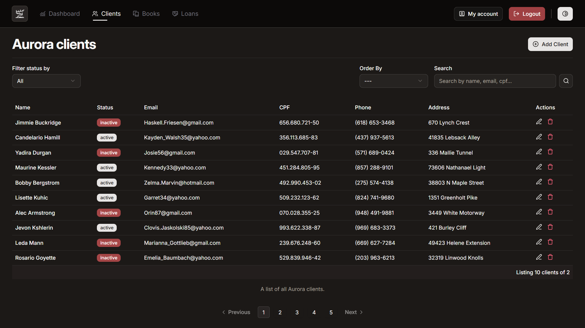

<div align="center">

  # **- 📙 Aurora Library -**
  
  

  
  
  
  
  
</div>

## 💡 Sobre o projeto
Projeto _fullstack_ para o gerenciamento de empréstimos de livros, bem como o gerenciamento dos livros e clientes da biblioteca. Feito para a empresa Aurora Library, tem o objetivo de facilitar o dia a dia de empréstimos na biblioteca. Este é o front-end do projeto; para ver o back-end acesse o repositório do [dev-benicio](https://github.com/Dev-Benicio/aurora-library)

## 📦 Instalação
Siga o passo a passo de como instalar o projeto na sua máquina.

1. **Clone o projeto do github**

  ```bash
    $ git clone -b main https://github.com/BrazucaDeveloper/aurora-library.git
  ```

2. **Entre na pasta do projeto**
  
  ```bash
    $ cd ./aurora-library
  ```

## 🚀 Como iniciar o projeto
> **Atenção:** Certifique-se de ter uma runtime de javascript, como o [Node](https://nodejs.org/en) e o [Pnpm](https://pnpm.io/pt/) instalados em sua máquina antes de prosseguir.

1. **Copie e renomeie o arquivo `.example.env`**

  ```bash
    $ cp .example.env .env
  ```

2. **Defina as variáveis de ambiente no arquivo `.env`**
  ```bash
    $ nano .env
  ```

3. **Inicie a aplicação**

  ```bash
    $ pnpm dev
  ```

4. **Acesse o projeto pelo navegador no link: http://localhost:5173/**

## ⚒️ Ferramentas utilizadas
- [⚡ Node](https://nodejs.org/en) (Runtime Javascript)
- [📦 Pnpm](https://pnpm.io/pt/) (Gerenciador de pacotes)
- [🚀 React Router v7](https://reactrouter.com/home) (Framework Javascript)
- [🎨 Shadcn UI](https://ui.shadcn.com/) (Biblioteca de componentes)
- [🔧 Biome](https://biomejs.dev/guides/configure-biome/) (Formatador/Linter Javascript)
- [🖌️ TailwindCSS](https://tailwindcss.com/) (Framework CSS)
- [🎭 Faker.js](https://fakerjs.dev/) (Biblioteca para mocking de dados)
- [🛡️ Zod](https://zod.dev/) (Biblioteca de validação de dados)

## 🧠 Mentes por trás do projeto
- [☕ Benício](https://github.com/Dev-Benicio) (Desenvolvedor back-end)
- [🎨 Ítalo](https://github.com/BrazucaDeveloper) (Desenvolvedor front-end)
